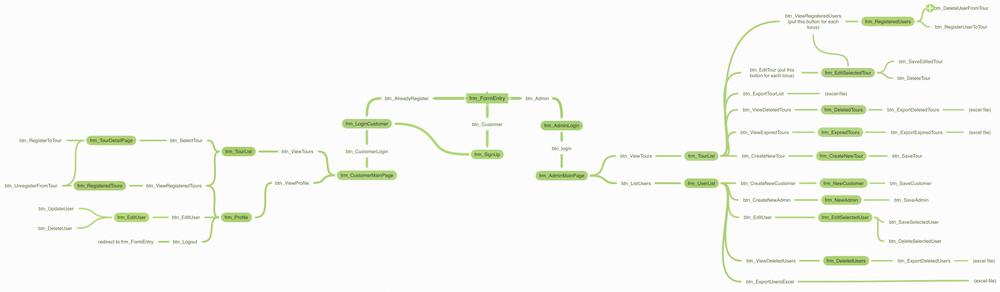

# Tour Tracer

Tour Tracer is a comprehensive database project designed to manage and store details about various aspects of a tourism agency, including tour types, customer information, staff details, and tour sales. This project aims to streamline the operations of the tourism agency by providing a centralized and organized database system.

## Features

- **Tour Types:** Keep track of different types of tours offered by the agency, including details such as destinations, durations, and costs.

- **Customer Database:** Maintain a database of customer information, including personal details, contact information, and preferences.

- **Staff Management:** Manage staff details, including tour guides, sales representatives, and administrative staff.

- **Tour Sales:** Record and monitor tour sales, tracking transactions, payment details, and customer feedback.

## Technologies Used

- **Database Management System:** [Specify the database management system used, e.g., MySQL, PostgreSQL]

- **Backend Development:** [Specify the backend programming language and framework used, e.g., Node.js with Express]

- **Frontend Development:** [Specify the frontend technologies used, e.g., HTML, CSS, JavaScript]

## How to Set Up

1. **Database Setup:**
   - Create a new database in your chosen database management system.
   - Import the provided SQL schema to set up the necessary tables and relationships.

2. **Backend Configuration:**
   - Configure the backend server to connect to the database.
   - Install required dependencies using the package manager specified in the project.

3. **Frontend Setup:**
   - Set up the frontend to communicate with the backend.
   - Customize the frontend interface based on your agency's branding.

4. **Run the Application:**
   - Start the backend server.
   - Open the frontend application in your preferred web browser.

## Usage

1. **Tour Types:**
   - Add, edit, or remove different tour types and their details.

2. **Customer Management:**
   - Maintain a database of customer information, including personal details and preferences.

3. **Staff Details:**
   - Manage staff details, roles, and responsibilities.

4. **Tour Sales:**
   - Record and monitor tour sales, update transaction details, and manage customer feedback.

## Contributing

If you find issues, have suggestions, or want to contribute to the development of Tour Tracer, feel free to create an issue or submit a pull request. Your contributions are highly appreciated!

## License

This project is licensed under the [MIT License](LICENSE). You are free to use, modify, and distribute the code as per the terms of the license.

Project Structure:

